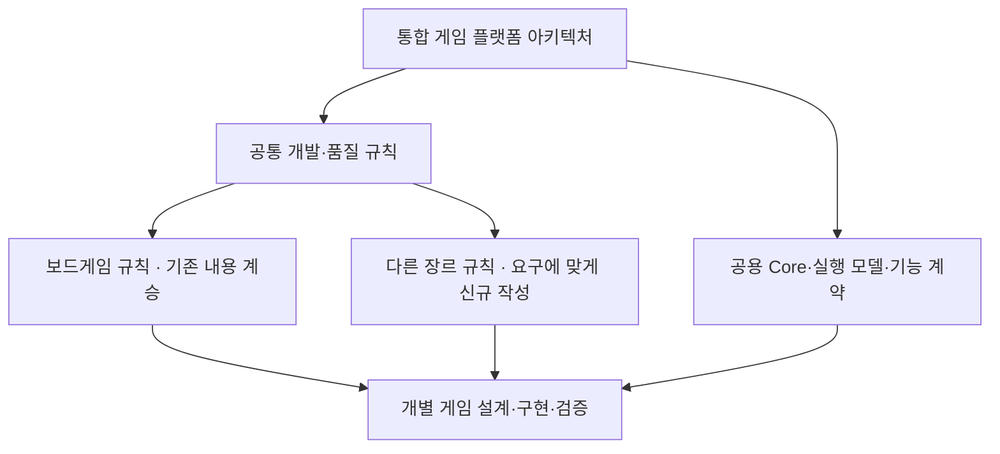

# 청파 같이 통합 게임 플랫폼 vNext — 단계별 실행 계획 확정본

> 개정 1.3 · 2026-09-30. 이 문서는 **하나의 게임 플랫폼 아키텍처 아래에 공통 개발 규칙과 장르별 규칙을 구성하고, 앞으로 개발할 모든 게임에 적용하기 위한 실행 지시서**다. 개정 1.2의 아키텍처·규칙 계승·22개 검토 지점·진행 기록 체계는 유지한다. 이번 개정은 **승인된 STEP 결과를 장기 integration branch에 누적하고, STEP PR과 최종 main 반영의 승인을 분리하기 위한 브랜치/PR 운영 변경**이다. 관련 기준선·기록·새 채팅 복원·진행 중 STEP 0 안내만 정합화한다. 아직 저장소의 `CURRENT` 실행 규칙이나 구현 완료 사실이 아니다. 실제 규칙 변경은 아래 단계의 개별 PR과 검토를 거쳐 반영한다.
>
> 기준 자료: `universal_web_game_platform_architecture_rebuild_plan(1).md`, `game_platform_architecture_review_patch_proposal.md`, `games_rules_architecture_comparison_review.md`, 저장소의 `AGENTS.md`, `games/` 하위 문서 14개 및 연결 규칙 문서 8개. 앞선 저장소 대조 기준은 `main`의 `c6b1e31b3fefef2c20a7a0f5841c5a16c996a559`이다. **이 비교 기준, STEP 0 착수 기준 main, integration 최초 생성 기준 main을 구분해 STEP 0에 기록한다.** 이후 STEP의 기준선은 §4에 따른 승인된 integration 상태다.

## 1. 목적과 범위

### 이루려는 상태

사용자가 `○○ 게임 개발 시작하자`라고 하면, 작업자는 게임 장르가 달라도 **같은 조사 → 설계 문서 → 구현 특성/공통 모듈 선택 → 작은 구현 → 검증 → 디자인 수동 검토 → 활성화** 순서를 재현할 수 있어야 한다. 공통 기능의 본체는 한곳에서 관리하고, 각 게임은 그 기능에 필요한 설정·정책·어댑터와 고유 규칙·콘텐츠·표현만 가진다.

턴제 보드/카드 외에 실시간 협동·대전, 공간 이동, 기록형, 비동기 진행, 중도 참가·관전, 장기 세션 등 **서로 다른 실행 방식을 수용하는 경계**를 만든다. 모든 장르의 엔진을 이번에 구현하거나 미래 변경이 영원히 없다고 약속하는 뜻은 아니다. 새 게임이 생길 때 Core를 반복해서 재작성하지 않고, 필요한 선택 모델이나 어댑터를 추가할 수 있는 상태가 목표다.

**모든 신규 게임의 개발은 이 통합 플랫폼 아키텍처 안에서 이루어진다.** 보드게임 규칙과 다른 장르의 신규 규칙은 플랫폼 아래의 개발 기준이다. 장르마다 등록·인증·초대·실행 수명을 독자적으로 다시 만드는 별도 플랫폼을 구축하지 않는다. `vNext`는 이번 확장 작업의 이름이며 별도 게임 서비스나 장르별 플랫폼의 이름이 아니다.

### 기존 규칙의 지위 — 기존 게임 코드와 구분

기존에 만든 **게임의 구현 코드**는 참고 자료다. 반면 기존 **플랫폼 규칙 문서에 축적된 개발 흐름·품질 기준·보드게임 개발 규칙**은 계승 대상이다. ‘기존 게임을 참고만 한다’는 지시를 ‘기존 규칙 문서를 임의로 약화·삭제해도 된다’고 해석하지 않는다.

- 조사·설계·네 문서·단계별 개발·검증·디자인 수동 검토·checkpoint처럼 장르를 넘어 유효한 규칙은 플랫폼 공통 영역으로 계승하고 필요한 세부 기준을 보강한다.
- 보드게임을 대상으로 만들어진 상세 규칙은 **보드게임 하위 규칙 체계**로 계승한다. 장르를 넘어 동일하게 쓰이는 snapshot/DB 등 기술 계약은 공용 모델 계약으로 두고 보드게임 규칙에서 참조할 수 있다. 원래의 의무·품질·제품 정책은 해당 적용 범위에서 유지한다.
- 다른 장르를 지원할 때에는 **그 장르의 규칙 문서를 새로 작성한다.** 기존 보드게임 문서에서 조사 수준·의사결정 기록·검증의 충실함은 배우되, 실행 흐름·조작·시간·공간·동기화·UI는 새 장르 요구를 독립적으로 조사해 설계한다.
- 계승은 파일 전체 복제나 기존 파일의 무조건적 물리 이동을 뜻하지 않는다. 각 조항의 의미와 새 책임 위치가 추적되고, 신규 보드게임도 그 규칙을 그대로 사용할 수 있어야 한다.

### 기존 게임의 지위 — 이번 요청의 우선 결정

- 현재 구현된 모든 게임의 **구체적인 구현 방식은 목표 아키텍처의 기준을 결정하지 않는다.** Can’t Stop·No Thanks를 포함해 기존 게임 코드는 참고 사례와 회귀 확인 대상으로 사용한다. 기존 Legacy 경로의 게임도 동일하다. 위에서 정한 공통/보드게임 규칙의 계승 의무는 별도로 유지한다.
- **기존 게임을 새 구조로 마이그레이션하지 않는다.** 기존 게임 폴더·규칙·UI·RPC·DB·Registry 설정을 vNext에 맞추기 위해 고치거나 새 네 문서로 재작성하지 않는다. 별도 장애 수정/유지보수는 별개의 작업이다.
- 현재 `games/shared/` 구현은 재사용 가능 여부를 판단하는 자료다. 특정 게임이 소비 중인 기존 모듈을 새 공통 계층으로 이름만 바꿔 이동하지 않는다. 안정된 초대·사이트 BGM 등은 중복 개발 없이 연결하되, 새 모델과 의미가 다르면 얇은 연결 어댑터를 둔다.
- 저장소의 현행 `AGENTS.md`와 Governance는 `CURRENT` 규칙/shared 계약 변경 시 기존 platform-native 게임의 영향도 감사를 요구한다. **이 감사는 생략하지 않는다.** 각 게임을 `COMPLIANT`/`NOT_APPLICABLE`/`MIGRATION_REQUIRED`로 증거와 함께 분류하되, `MIGRATION_REQUIRED`가 발생하면 기존 게임을 고치는 대신 vNext의 격리·스코프·버전 경계를 다시 설계한다. 변경으로 기존 게임을 깨지 않는 것이 해당 단계의 통과 조건이다.

### 작업에서 제외

기존 게임 이관, 게임 규칙·디자인 교체, 기존 출시 문서의 일괄 정리, 초대 로직의 새 엔진 제작, 전용 3D/물리/리듬/RTS 엔진의 선제 구현, 모든 기능의 공통화, 운영 DB의 선제 변경, 정식 게임의 공개 활성화는 이 계획의 자동 수행 범위가 아니다. 예를 들어 No Thanks 문서의 출시 상태 불일치는 별도 정합성 이슈로 기록할 수 있으나, vNext 구현의 선행 조건으로 확대하지 않는다. 이미 확인된 Snapshot Coordinator의 늦은 콜백 문제도 기존 게임 긴급 수정과 vNext의 수명 계약을 분리해서 다룬다.

## 2. 확정한 설계 원칙

### 통합 플랫폼 안에서 문서와 구현을 연결

문서 체계는 **플랫폼 아키텍처/공통 규칙 → 장르별 규칙 → 개별 게임의 네 문서**로 내려간다. 코드 구조는 Core·공용 실행 모델/기능·Adapter를 각 게임이 선택해서 연결하는 방식이다. 두 관점은 같은 플랫폼을 설명한다. 장르별 문서가 있다는 이유로 장르별 Core를 복제하거나 장르 이름으로 런타임을 상속시키지 않는다.

혼합 장르 게임은 여러 장르 규칙에서 필요한 항목을 적용할 수 있다. 동일 주제의 충돌은 담당 규칙의 적용 조건으로 해소해 `GAME_SPEC`에 남긴다. 기본 보안·수명·문서 품질 의무를 하위 규칙이 임의로 약화할 수 없다. 상위 계약 변경이 필요하면 기존 Architecture Change 절차를 따른다.

| 원칙 | 구체적인 적용 |
|---|---|
| 논리적 경계 | 하나의 플랫폼 안에서 **최소 Core, 공용 Runtime Models/Capabilities, 조합 Profile, Game-local, Site Adapter**의 책임을 구분한다. 장르 규칙은 어떤 계약을 선택하고 어떻게 구현·검증할지 안내한다. 이 구분은 장르별 독립 런타임이나 네 단계의 코드 상속 구조를 뜻하지 않는다. |
| Core의 최소성 | 게임 식별·등록/발견, 실행 인스턴스와 수명 범위, 구성 연결, 계약/오류/정리의 공통 규약만 다룬다. Room·host·턴·점수·DOM·Canvas·tick·RPC·snapshot을 모든 게임에 강제하지 않는다. |
| 선택 모델 | 실행/시간, 세션/참여, 권위/동기화/복구, 입력/표현/공간, 지속성의 의미를 각 모델이 소유한다. 서버 권위의 턴제 snapshot 방식은 **한 가지 검증된 모델**이지 모든 온라인 게임의 정의가 아니다. |
| Capability | Invite, Presence, Resume, Rematch, Result 소비, Sound 등은 해당 의미가 있을 때 연결한다. 같은 기능의 토큰 처리·수명·중복 방지 같은 본체를 게임마다 복사하지 않는다. 서로 다른 정책/호환 조건은 명시한다. |
| Profile | 검증된 모델 조합과 기본값·금지 조합·검증 항목을 알려주는 **레시피**다. Profile 전용 게임 규칙이나 상속 엔진을 만들지 않으며, 조합이 반복되기 전에는 Profile도 만들지 않는다. |
| 장르별 규칙 | 보드게임·액션/협동·리듬 등 적용 대상의 조사·게임 경험·실행/품질 요구를 정의하는 하위 문서다. Profile과 다른 역할이며 새 장르를 본격 개발하기 전에 준비한다. 보드게임 문서는 계승하고, 다른 장르 문서는 독립 요구 조사로 작성한다. |
| Game-local | 규칙, 콘텐츠, 도메인 상태·계산, UI/시각 정체성, 전용 입력, 해당 게임만의 서버 로직을 소유한다. 공통 기능을 쓰는 얇은 설정·연결 파일은 허용한다. |
| Site Adapter | 청파 같이의 승인회원·프로필, 라우팅·카탈로그·공개·공지·기존 초대·BGM과 플랫폼 코어 사이를 연결한다. 접근 제어의 실제 집행은 선택 백엔드/서버가 소유하며 Registry 표시값이 보안 경계가 되지 않는다. |
| 공존과 기본 적용 | 준비 완료 이후 **모든 신규 게임은 통합 플랫폼을 기본으로 적용**하고 적용 계약 버전·장르 규칙·실행 모델을 명시한다. 버전 선언은 플랫폼을 우회하는 opt-out 수단이 아니다. 기존 게임은 현재 public API와 코드 경로를 보존한다. |
| 증거 | 문서상의 가능/지원, 계약 테스트 통과, 실제 두 클라이언트 검증, production 활성화를 분리해 표시한다. 검증 전에는 ‘지원 완료’로 쓰지 않는다. |

공통 코드의 승격 경로는 **Game-local → 재사용 가능한 Model/Capability**다. Profile은 코드 승격 단계가 아니다. Core 편입은 여러 게임에서 쓰인다는 이유만으로 허용하지 않으며 필수성·안정성·낮은 결합을 따로 심사한다. 이미 존재하는 공통 기능은 먼저 의미와 API를 확인해 재사용한다. 아직 반복되지 않은 새 기능을 억지로 공유 계층에 올리지 않는다.

### 장르에 무관하게 검증할 안전성

권한 없는 참여/상태 조회 금지, 비공개 정보의 역할별 격리, 서버 또는 정해진 권위자의 상태 판정, 중복 입력의 안전성, 충돌 시 일관된 결과, 재연결 후 현재 상태 복원, 실행 종료/방 이동 후 늦게 도착한 콜백 무효화는 실행 방식별로 **동등한 의미**로 검증한다. 구현 방식은 모델별로 다를 수 있다. 예를 들어 tick 기반 게임에 정수 `expectedVersion`이나 Supabase DB snapshot을 강요하지 않는다. 클라이언트 예측 상태의 결과를 확정 통계나 보상으로 소비하지 않는다.

### 장기 확장을 위해 지금 경계만 정할 것

- **Result/Statistics:** 경기·run 종료와 참가자 outcome을 분리한다. 공식 결과의 식별·확정·정정 책임과 통계/보상 소비 경계를 정하지만, 모든 게임에 승자·점수·XP를 요구하지 않는다.
- **Publication:** 소스 병합, 기능 구현, 실제 공개 활성화는 별개다. 출시 사실과 사이트 공지/표시는 분리한다. NEW 표시와 공지는 필요해질 때 식별 가능한 공개 사건을 기반으로 만들고, 이번 단계에서 자동화 서비스를 선제 구축하지 않는다.
- **Presentation/Sound:** 게임별 승인된 디자인·결과 연출을 공통 화면으로 교체하지 않는다. 사이트의 기존 BGM 도구를 우선 활용하고, 새 오디오 엔진은 요구와 반복 구현이 증명될 때 검토한다.
- **독립적인 실행:** 외부 게임 엔진이나 새 백엔드를 쓰더라도 등록·접근·수명·선택 기능 연결 계약을 충족하면 플랫폼 게임으로 취급한다. 기존 DB/RPC 호출 규격을 흉내 내야만 플랫폼 게임이 되는 구조는 만들지 않는다.

## 3. 문서와 코드의 목표 책임

기존 `AGENTS.md`의 별도 작업 브랜치·PR 검토·명시적 승인 원칙과 기존 네 문서의 **책임/시간축**은 보존한다. 이번 재구축의 분기 기준과 PR base는 사용자 확정에 따라 §4의 integration 운영을 적용하며, 다른 작업의 Governance로 확대하지 않는다. 플랫폼 전체를 설명하는 아키텍처와 공통 규칙을 상위에 두고, 기존 보드게임 규칙과 다른 장르의 신규 규칙을 그 아래에 연결한다. 기존 소비자 보호와 신규 게임 규칙 계승은 함께 충족한다. 각 세부 의미는 한 책임 문서가 소유하며 진입 문서에는 링크와 핵심 조건만 둔다.

| 책임 문서/코드 | vNext에서 할 일 | 경계 |
|---|---|---|
| 플랫폼 아키텍처 책임 문서 | 게임 영역 전체의 계층·의존성·공통 계약·확장 지점·장르 규칙 연결을 정의 | 장르 문서가 없어도 동작하는 임의의 별도 플랫폼을 허용하지 않음 |
| 공통 개발/품질 규칙 | 기존 개발/UI 규칙의 범용 절차를 계승하고 조사·판단·검증 기준을 보강 | 공통 절차를 모든 장르 문서에 복제하지 않음 |
| `AGENTS.md` | 아키텍처 → 공통 규칙 → 적용 장르/모델 규칙을 읽고 개발하도록 진입 순서 명시 | 기존 게임에 새 의무를 소급 적용하지 않음 |
| 기존 `docs/game-platform-development-rules.md`의 조항 | §3A·§3B·§15 등의 공통 흐름은 상위 공통 규칙으로 계승. 보드게임의 상세 lifecycle은 보드게임 하위 규칙으로 연결 | 기존 파일의 위치만으로 전체 내용을 공통/장르 전용으로 일괄 판정하지 않음 |
| 기존 `docs/game-platform-ui-rules.md`의 조항 | 조사·baseline·후속 결정·수동 검토는 공통으로 계승. 실제 보드게임 공간·구성물 표현 기준은 보드게임 하위 규칙으로 계승 | 다른 장르의 카메라/HUD/조작/정밀 타이밍 규칙은 그 요구에 맞게 새로 작성 |
| 보드게임 장르 규칙 묶음 | 기존 문서의 보드게임 대상 규칙을 원문 출처와 의미까지 추적해 계승. 상위 공통 규칙과 관련 모델 계약을 참조 | 기존 게임 유지보수에만 묶어두지 않고 **새 보드게임 개발에도 사용** |
| 다른 장르별 신규 규칙 문서 | 새 장르의 조사·설계·실행/상태·UX·성능·테스트·완료 기준을 정의하고 플랫폼에 연결 | 기존 보드게임 문서의 이름만 바꿔 복제하지 않음. 한 문서에 충분하면 불필요하게 나누지 않음 |
| `docs/game-platform-db-test-contract.md` 및 모델 계약 | Supabase DB/RPC·snapshot 등 선택한 구현 모델의 상세 기준. 보드게임과 다른 장르가 같은 모델을 쓰면 같은 계약 참조 | 기술 모델을 특정 장르의 독점 소유로 만들지 않음. 비DB 모델에는 동등한 안전성 검증 정의 |
| `docs/game-platform-governance.md` 및 Guard | 아키텍처/공통/장르/모델 문서의 권위·적용 조건·경로 탐색·계약 테스트·기존 소비자 영향 확인 | 새 문서가 현행 Guard의 범위 밖에서 고립되지 않도록 함 |
| `games/README.md`, 네 템플릿 | 공통 흐름과 장르 규칙 목록 진입점, 선택 근거와 공통 모듈 연결 기록 추가 | 네 문서 역할과 디자인 override 보존. 장르별 추가 항목만 필요에 맞게 작성 |
| `games/shared/`의 공통 모듈 안내 | 모듈 의미·API·적용 모델·연결법·수명 소유자·검증/상태 표시 | 구현되지 않은 후보를 ‘사용 가능’으로 표시하지 않음 |
| vNext 구현 | 미래 신규 게임이 공동으로 사용하는 최소 Core/선택 모듈/Adapter와 테스트 | 현행 `games/shared` 모듈·기존 게임 import를 일괄 이동/교체하지 않음 |

실제 파일 배치는 **STEP 6에서** Guard·build·import 경계를 확인한 후 결정한다. `games/` 바로 아래 `core/`, `models/`, `profiles/`를 미리 만들지 않는다. 현행 Guard는 `games/shared` 외 직계 디렉터리를 게임으로 취급하고 새 `games/shared/*.js`만 탐지하므로, `games/shared/vnext/` 같은 중첩 경로를 선택한다면 **그 경로를 추가하기 전에** Guard·테스트 탐색을 함께 확장해야 한다. 경로보다 API의 의미와 기존 소비자 격리가 우선이다.

장르 문서의 논리적 배치 예시는 `플랫폼 공통 → 보드게임 규칙 묶음 / 실시간 협동·액션 규칙 / 리듬 규칙 → 개별 게임`이다. 실제 파일은 기존 경로를 유지하고 상위 목차에서 연결하거나, 단계별로 새 문서 경로에 옮길 수 있다. 어느 방법이든 원본 의미, 기존 링크, 현재 적용 대상을 추적한다. 역사 문서와 개별 게임의 디자인 baseline은 새 현재 규칙으로 재작성하지 않는다.

### 기존 규칙 계승표 — 빠진 조항을 검출하는 기준

STEP 1에서 **기존 규칙의 조항 단위 계승표**를 만들고 STEP 6/7에서 확정·검증한다. 다음 표는 핵심 분류의 예시이며 전수 계승표 작성이 이미 완료됐다는 뜻이 아니다.

| 기존 규칙/출처 | 새 구조의 책임 위치 | 보존·보완할 내용 |
|---|---|---|
| Development §3A·§15, AGENTS의 신규 게임 시작 | 공통 개발 흐름 | 요청만으로 조사 → 네 문서 → 작은 구현 → 검증 → 수동 디자인 검토 → 활성화로 진행. 장르 규칙 탐색/생성 절차 추가 |
| Development §3B, UI Rules §6 | 공통 기록/인수인계 | 기능 기준·진행과 디자인 baseline·후속 결정 분리, 두 checkpoint 명령, 최신 유효 디자인 결정 우선 |
| Development §4, UI Rules §12 | 공통 재사용 규칙 | 공통 본체 우선 사용, 게임 고유 규칙/콘텐츠/표현은 local, 출시 후 플랫폼 회고 |
| Development §5 및 release closeout | 공통 Registry/출시 기준 | 문서 bootstrap·runtime 등록·기능 활성화·운영 검증 구분, 미구현 기능의 허위 선언 금지 |
| Development §6·§10B의 현행 Room/재대결 정책 | 보드게임 하위의 해당 lifecycle 규칙 + 필요한 공용 세션 계약 | 현재 적용 대상의 same-room/ready/host 의미 유지. 다른 장르의 정책은 별도로 설계 |
| Development §7~9, DB/Test Contract | 공용 권위/동기화 모델 및 보드게임 규칙의 참조 | DB snapshot 모델의 version·멱등성·동시성·복구 기준 유지. 비DB 모델에 같은 SQL을 강제하지 않음 |
| Development §6A, Access Gate | 사이트 정책 연결 | 승인회원·프로필 닉네임 정책을 유지하면서 적용 지점을 명시. 사이트 정책과 Core/장르 규칙의 책임 구분 |
| Development §10A, UI Rules §5A | 공통 안내/종료 기준 + 장르별 UX | 시작 전/플레이 중 규칙 확인, 안전한 종료·이탈, 권위/확인 UX. 실제 상호작용은 장르별 구체화 |
| Development §11, 현재 Invite 계약 | 공용 기능 + 적용 모델/사이트 연결 | 토큰·공유·진입 본체 재사용. 장르별 초대 엔진을 만들지 않음 |
| UI Rules §2~5·§6·§11 | 공통 디자인 과정 | 출처·권리·시각 정체성·초기 계획·수동 검토 보존. 새 장르에 맞는 조사 증거 추가 |
| UI Rules §7, 템플릿의 보드/카드 구성 예시 | 보드게임 하위 디자인 규칙 | 실제 구성물·공간 구조와 표현 기준 보존. 카메라·HUD·오디오 타이밍의 대체 기준으로 오용하지 않음 |
| Development §13~14B, Governance | 공통 변경 관리 | topic-owner·Architecture Change·기존 소비자 영향도·Guard/계약 검증 유지, 새 장르 문서도 같은 절차에 연결 |

전수 표에는 `규칙 ID / 기준 SHA·출처 절 / 원래 MUST·SHOULD와 의도 / 새 책임 문서·절 / 적용 범위 / 유지·세분화·보강·참조 전환 / 검증 증거`를 기록한다. 하나의 조항을 여러 책임으로 나누면 각 조각의 목적지를 모두 남긴다. 단순히 ‘범용화에 불편함’을 이유로 MUST를 SHOULD로 낮추거나 적용 대상 보드게임에서 제거하지 않는다. 원문 오류/중복을 바로잡아야 하면 근거와 결정 기록을 남긴다. **목적지가 없는 조항, 설명 없는 의무 완화, 서로 다른 CURRENT 정의가 남으면 문서 개편 게이트를 통과할 수 없다.**

### 새 장르 규칙을 만드는 절차와 최소 내용

새 장르 문서는 해당 장르의 실질적인 gameplay/runtime 개발 전에 작성·검토한다. 필요한 규칙이 아직 없다면 신규 게임 요청의 조사 단계 안에서 규칙 초안부터 준비한다. 같은 의미의 규칙 묶음이 있으면 참조/보완하고, 실제로 새 장르 기준이 필요하면 새 문서를 만든다. 보드게임 외 모든 장르의 문서를 지금 미리 완성하지는 않는다. 이번 작업에서는 적어도 첫 비보드 Probe의 규칙 문서를 실제 작성해 이 절차를 검증한다.

장르 문서는 최소한 다음을 포함한다.

1. **범위와 출처:** 적용되는 경험/장르·제외 범위, 자료·대표 사례, 확인된 사실과 설계 판단. 단순 장르 이름 외에 실행 특성을 명시한다.
2. **플랫폼 연결:** 상위 아키텍처/공통 규칙 버전, 선택 가능한 실행 모델·기능, 의존 조건·금지 조합, 공통 모듈 연결 위치.
3. **독립적인 장르 요구:** 플레이 흐름, 조작·카메라/공간, 시간 정확도·권위·정보 가시성, 시작/복원/종료 등 해당 장르에서 실제 필요한 내용. 해당 없음의 이유도 기록한다.
4. **개발/문서 보완:** 공통 조사·네 문서·구현 흐름에 추가할 항목과 장르별 결정 질문. 기존 보드게임 절차에서 참고한 부분과 채택하지 않은 전제의 이유를 기록한다.
5. **검증과 완료 기준:** 기능·상태/복구·조작·반응성·접근성·다중 클라이언트 등 적용 테스트와 측정 조건, 수동 플레이 검토, 미지원 항목.
6. **권위와 이력:** 규칙 소유자, 문서 상태, 적용 조건, 다른 장르/모델과 겹치는 규칙의 책임 위치, 변경 이유·영향·재검증 범위.

상위 규칙은 이 문서를 인덱스에서 발견할 수 있어야 한다. `GAME_SPEC`에는 적용한 공통·장르·모델 규칙과 선택 근거를 적는다. 문서가 있다는 사실만으로 엔진/네트워크 기능이 구현되었다고 판단하지 않는다. 새 규칙이 상위 계약을 바꿔야 하면 먼저 Architecture Change를 검토한다.

### 신규 게임을 시작할 때의 일정한 절차

1. 플랫폼 아키텍처·공통 규칙·장르 규칙 인덱스·공통 모듈 안내를 읽고 게임/제품 범위 및 규칙·디자인/자산 출처를 조사한다. 보드게임은 계승한 보드게임 규칙을 적용한다. 다른 장르의 적합한 문서가 없으면 위 절차로 새 장르 규칙을 작성·검토한다.
2. 적용 장르 규칙과 함께 선택표에 흐름·시간·세션/참여·권위/동기화·복원·공간·입력·렌더링·결과/지속성·선택 Capability를 기록한다. 혼합 장르의 충돌을 해소하고, 해당 없음과 미지원/미결정을 구분한다.
3. 먼저 존재하는 모듈의 의미·버전·연결 조건을 확인하고, 재사용 가능 여부·게임별 어댑터·새 계약 필요 여부를 결정한다. 새 장르 규칙도 동일한 플랫폼 계약 안에서 모듈을 연결해야 한다.
4. 구현 전에 `GAME_SPEC`, `DEVELOPMENT`, `UI_DESIGN`, `UI_DECISIONS` 네 문서를 만든다. 기능 기준/진행과 디자인 baseline/후속 결정의 역할은 기존대로 분리한다.
5. 게임을 작게 나눠 구현하고 모델별 계약, 게임 규칙, 권한/복원/수명, 화면·조작을 검증한다. Bootstrap만 존재할 때 Registry 비노출, runtime을 추가할 때 명시적 등록, 실제 제공 가능할 때 활성화한다.
6. 기능 완료 뒤 실제 브라우저 수동 디자인 검토와 출시/운영 검증을 수행한다. 기능/디자인 체크포인트 명령은 기존 책임 문서와 경계에 따라 처리한다.

게임 폴더에 `invite.js` 같은 파일이 있다는 이유만으로 중복 구현이라 판단하지 않는다. **게임별 연결과 공통 동작의 재구현을 구분**한다. 동일한 초대 토큰·공유·복원 본체가 여러 게임에 생기지 않는지를 diff와 테스트로 확인한다.

## 4. 실행 규칙 — 단계별로 멈추는 방법

아래 STEP은 **순차 작업**이다. `STEP 0~12 전부 실행` 같은 일괄 요청을 하지 않는다. 각 번호와 하위 번호를 한 작업 단위로 요청하고, 해당 산출물을 읽어 수정·승인한 뒤 다음 단계를 지시한다. 설계에서 예상 밖의 결함이 나오면 해당 설계 단계로 돌아간다. 코드 구현 중 발견한 새 제품 결정은 게임 코드를 먼저 넓히지 말고 계약 결정으로 되돌린다.

정식 저장소 기준 브랜치는 `main`, vNext 누적 통합 기준 브랜치는 **`feature/game-platform-vnext-integration`**으로 구분한다. integration은 STEP 0에서 **생성 시점의 실제 최신 main을 기준으로 최초 1회** 만들고 그 main SHA를 기록한다. 이미 생성됐다면 기존 계보와 상태를 확인해 이어 쓰며 다시 만들거나 초기화하지 않는다. integration은 사용자 검토와 명시적 병합 승인을 통과한 STEP 결과를 순서대로 누적하는 기준 브랜치다. STEP 구현·문서 수정·기록 작업은 별도 작업 브랜치에서 수행하고 integration에서 직접 누적 개발하지 않는다.

integration 생성 이후 새 단계는 **최신 integration 상태 → CURRENT/checkpoint → 직전 승인 STEP의 integration 반영 확인 → 해당 STEP 전용 브랜치 생성** 순서로 시작한다. 동일 root-slug를 공유하는 단계별 별도 브랜치를 유지한다. 예: `docs/game-platform-vnext-phase1-audit`, `feature/game-platform-vnext-phase7c-core`. 다음 STEP은 직전 결과가 승인되어 integration에 반영됐고 다음 단계 진행도 허용됐는지 확인한 뒤 시작한다. **채팅방 변경은 새 단계 시작이 아니다.** 유효한 checkpoint가 가리키는 미완료 브랜치는 그대로 이어가며 main이나 integration에서 같은 작업을 다시 만들지 않는다.

각 단계는 필요한 파일만 수정하고 **작업 → 검증 → STEP PR 제출 → 사용자 검토 → 명시적 승인 → integration에 merge** 순서를 따른다. STEP PR의 기본 방향은 `STEP branch → feature/game-platform-vnext-integration`이다. PR의 base/head, diff, 검증, 기존 소비자 영향도를 함께 제출한다. STEP 결과를 매번 main에 병합하지 않는다. main에 직접 commit/push하지 않으며, integration과 main 어느 대상으로도 사용자 명시적 승인 없이 merge하지 않는다. integration을 둔다는 이유로 여러 STEP을 일괄 수행하거나 각 검토 지점을 합치지 않는다.

사용자는 재구축 중 개인적으로 main에 새 기능 개발 결과를 추가하지 않을 예정이다. 이는 저장소 전체의 개발 금지 Governance가 아닌 이번 작업의 운영 가정이다. **매 STEP 시작마다 최신 main을 다시 기준으로 잡거나 main과 integration을 반복 비교·동기화하지 않는다.** 예상과 달리 main의 별도 변경이 실제 발생한 경우에만 그 차이·영향·처리 방안을 별도로 검토하고 기록한다. 그 경우에도 무조건 동기화하거나 기존 작업 계보를 초기화하지 않는다.

**integration → main은 STEP PR과 별개의 최종 반영 승인 게이트**다. 적절한 완료 시점에 실제 main 상태와 integration의 최종 차이·영향을 확인하고 최종 검증을 거쳐, 별도 PR과 사용자 명시적 승인으로 반영한다. STEP의 검토 통과나 integration 병합은 main 반영 승인으로 확대하지 않는다. 이 개정은 구체적인 최종 병합 시점을 새로 정하거나 앞당기지 않으며, STEP 12의 준비 완료와 main 반영·운영 공개 상태도 구분한다.

한 단계 결과 보고에는 최소 **(1) 결정/남은 쟁점 (2) 변경 파일과 STEP PR의 base/head·검토/승인/integration 병합 상태 (3) 검증 결과 및 미실행 이유 (4) 기존 게임 영향도 (5) 규칙 계승/장르 문서/상위 계약 연결의 변경 사항 (6) 다음 단계의 정확한 입력과 integration 기준선**이 들어가야 한다. `통과`는 다음 단계에 갈 준비를 뜻하며 전체 아키텍처가 완성됐다는 뜻이 아니다. integration → main 반영 상태는 STEP PR 상태와 별도로 보고한다.

**이 문서의 저장소 내 기준 위치는 루트의 `game_platform_vnext_final_execution_plan.md`로 고정한다.** 사용자가 루트에 놓은 파일을 STEP 0에서 실제 작업 기준으로 확인하고 버전 관리한다. 진행 기록 디렉토리에 계획 전문을 다시 복제하지 않는다. 작업 범위·순서·통과 기준은 이 문서가 정하고, 아래 기록은 실제 진행과 승인된 결정을 전달한다. 단계 진행만으로 기준 계획을 매번 수정하지 않는다. 제품/플랫폼 규칙의 본격 개편은 STEP 7에서 수행한다. STEP 0에서 허용하는 `AGENTS.md` 수정은 **이번 재구축에 한정된 브랜치/PR 운영 참조와 기록·재개 진입 경로 연결**에 한정한다.

### 4.1 진행 기록 디렉토리와 책임

STEP 0에서 `docs/game-platform-rebuild/`를 만든다. 게임별 `DEVELOPMENT.md`나 `UI_DECISIONS.md`와 분리된 **플랫폼 재구축 작업의 인수인계 기록**이다. 아래 파일/경로만으로 시작하고, 존재하지 않는 작업 결과를 미리 완료한 것처럼 만들지 않는다.

| 저장소 경로 | 역할과 갱신 방식 |
|---|---|
| `game_platform_vnext_final_execution_plan.md` | 루트의 단일 실행 계획. 목표·범위·단계·통과 기준을 소유 |
| `docs/game-platform-rebuild/README.md` | 고정 진입점. 루트 계획과 CURRENT/DECISIONS/checkpoints를 링크하고 읽기 순서·두 명령·integration/현재 STEP 브랜치 탐색 기준을 설명 |
| `docs/game-platform-rebuild/CURRENT.md` | 현재 상태의 한 곳. 22개 검토 지점의 진행표, integration과 마지막 반영 승인 STEP, 현재 STEP/작업 브랜치/PR, 최신 checkpoint, 검토·승인·integration 병합 상태, main 반영 여부, 다음 첫 작업을 갱신 |
| `docs/game-platform-rebuild/DECISIONS.md` | 누적 결정 목록. 채택·제안·폐기·대체 상태, 결정 이유와 관련 증거를 유지. 현재 유효 결정을 쉽게 찾을 수 있게 함 |
| `docs/game-platform-rebuild/checkpoints/CP-0001-step-0.md` 등 | 단계 시작/완료·중간 기록의 사실과 증거. 순번을 증가시키고 기존 기록은 보존. 같은 단계도 여러 checkpoint 가능 |
| `docs/game-platform-rebuild/artifacts/` | 단계 산출물인 감사표·전수 계승표·stress matrix·Target 설계·중요 검증 근거. CURRENT와 checkpoint에서 실제 경로로 연결 |

`CURRENT.md`는 현재 작업 상태이지 플랫폼 규칙의 `CURRENT` 분류를 대신하는 rulebook이 아니다. `DECISIONS.md`도 루트 계획의 목표나 상위 실행 규칙을 묵시적으로 바꿀 수 없다. 계획 변경이 승인되면 루트 문서를 명시적으로 개정하고 변경 이유·영향·재검증 단계와 승인 근거를 결정 기록에 연결한다. 기록 파일과 산출물은 실제 읽을 수 있는 저장소 상대 경로를 사용한다.

### 4.2 기록해야 할 정보와 상태

`CURRENT.md`와 각 checkpoint에는 다음 정보가 복원 가능해야 한다. 짧은 CURRENT에는 요약과 링크를 두고, 상세 근거는 checkpoint/DECISIONS/artifacts에 둔다. 채팅 전문을 복사하는 대신 다음 작업의 판단에 필요한 사실을 보존한다.

- **계획 기준:** 루트 파일 경로, 문서 개정, 기록 시 확인한 계획 내용의 hash 또는 commit, 작업 root-slug `game-platform-vnext`.
- **진행:** 현재 STEP/하위 번호, 허용된 작업 범위, 실제 완료 항목, 미완료 항목, 단계 상태, 마지막 기록 ID, 작성 시각(시간대 포함).
- **통합 기준 위치:** 정식 기준 브랜치 `main`, STEP 0 착수 main SHA, integration 최초 생성 기준 main SHA, vNext integration 브랜치명·확인한 HEAD, integration에 반영된 마지막 승인 STEP과 PR/반영 commit. main SHA는 매 STEP의 새 기준으로 갱신하지 않고, 예외적 main 변경 검토나 최종 반영 검증 시 별도 사실로 기록한다.
- **현재 작업 위치:** STEP 작업 브랜치, 분기한 integration 기준 SHA, checkpoint 저장 직전 작업 HEAD, STEP PR 주소/번호와 실제 base·head·병합 여부. 관련 파일과 실제 산출물 위치. integration 생성 전 착수한 STEP 0의 원래 main 분기 기준은 이력으로 보존한다.
- **판단:** 승인된 요구와 설계 결정, 이유·대안·폐기 이유, 유지해야 할 경계, 결정 변경/대체 관계. 특히 기존 규칙 계승·새 장르·기존 게임 무이관 원칙의 변경 여부.
- **검증:** 실행 명령/대상/결과와 그 결과가 적용되는 코드 상태, 미실행·실패·미확인 항목과 이유, 재검증 필요 여부. 수행하지 않은 검증을 통과로 표시하지 않음.
- **검토/승인:** 결과 제출, 사용자 검토, 설계 승인, STEP PR의 integration 병합 승인/실제 병합을 구분한다. integration → main의 별도 승인·PR·반영 여부/commit도 구분해 기록한다. 확인 가능한 승인 내용·대상 STEP/PR·목적 브랜치·날짜를 남기고 대화 내용을 짐작해 승인으로 만들지 않는다. 미수행·미확인 상태를 반영 완료로 표시하지 않는다.
- **재개 지점:** 다음 첫 행동 하나, 그 다음 작은 작업 목록, blocker/미결정, 열어야 할 파일, 재현 명령, 이미 시도한 실패 방법과 다시 반복하면 안 되는 이유.
- **저장 상태:** 작업 파일과 산출물이 원격에서 재현 가능한지, 아직 보존되지 않은 변경/누락이 있는지. 로컬에만 있는 파일을 원격 저장 완료로 기록하지 않음.

단계 상태는 `NOT_STARTED / IN_PROGRESS / BLOCKED / REVIEW_PENDING / COMPLETED`로 관리한다. 구현/문서 작성이 끝나도 사용자 검토가 남아 있으면 `REVIEW_PENDING`이다. `COMPLETED`는 해당 단계의 통과 기준과 필요한 검토가 충족된 상태이며, STEP PR의 integration 병합 상태와 다음 단계 진행 승인은 별도 필드로 기록한다. 다음 STEP 시작 시에는 실제 integration 반영까지 확인한다. integration → main 반영은 이 상태표와 별도의 승인/반영 상태다. 중간 기록은 완료 처리가 아니다. `확인되지 않음`을 `없음`으로 바꾸지 않는다.

checkpoint commit 자신의 SHA를 같은 파일 안에 미리 적으려 하지 않는다. 파일에는 **저장 직전 HEAD + checkpoint ID**를 기록하고, commit/push 후 실제 원격 SHA를 결과 보고로 확인한다. 새 채팅은 해당 기록을 포함한 Git commit을 조회해 최신 checkpoint와 실제 소스 상태를 검증한다.

### 4.3 자동 기록 시점

다음 경우에는 사용자가 따로 요청하지 않아도 기록한다.

1. STEP/하위 STEP을 시작하며 범위와 기준 브랜치를 확정했을 때.
2. 각 단계의 산출물·검증 결과를 제출하고 검토를 기다릴 때, 그리고 검토 결과/승인/병합 상태가 확정됐을 때.
3. 중요한 설계 결정·요구 변경·실패 원인·blocker가 생겼을 때.
4. 단계가 길어지는 경우, 복원하기 어려운 조사·설계 결과나 재현 가능한 구현 단위가 끝났을 때. 단계 전체가 끝날 때까지 기록을 미루지 않는다.

기록을 만들면 CURRENT의 최신 포인터와 상태를 함께 갱신하고, 결정이 바뀐 경우에만 DECISIONS를 갱신한다. 과거 checkpoint는 그대로 두며 오류는 정정 기록으로 연결한다. 대화 길이 한계 직전임을 시스템이 항상 감지한다고 가정하지 않는다. 자동 기록과 아래 수동 명령을 함께 사용해 유실 범위를 줄인다.

### 4.4 명령: `작업 진행 기록하자`

이 문맥에서 이 명령은 **현재 아키텍처 재구축 작업의 중간 checkpoint 저장**을 뜻한다. 게임별 `기능 체크포인트 기록하자`/`디자인 체크포인트 기록하자`와 다른 명령이며 해당 게임 문서를 자동 수정하지 않는다.

1. 현재 실행/편집 상태를 확인하고 추가 범위로 작업을 넓히지 않는다. 완성되지 않은 단계는 `IN_PROGRESS` 또는 `BLOCKED`를 유지한다.
2. 현재까지의 완료/미완료·결정·검증·다음 첫 행동을 checkpoint에 쓰고 CURRENT/필요한 DECISIONS를 함께 갱신한다.
3. 새 채팅에 넘길 실제 변경을 보존한다. 안전하게 보존할 수 있는 미완성 코드/문서도 유효한 작업 브랜치에 **WIP checkpoint**로 commit/push할 수 있다. 미완성을 출시 가능 상태로 간주하거나 검증을 꾸며내지 않는다. 관련 산출물·추적되지 않은 필요 파일도 빠졌는지 확인하고, 무관한 사용자 변경은 섞지 않는다.
4. 기존 미병합 작업 PR이 있으면 그 브랜치를 이어가고, 없다면 최신 integration 기준의 작업/기록 브랜치에서 integration을 base로 PR을 제출한다. checkpoint마다 새 브랜치/PR을 중복 생성하지 않는다. 작업·기록 변경을 main이나 integration에 직접 commit/push하지 않으며 어느 대상에도 승인 없이 merge하지 않는다. 최초 integration 생성과 진행 중 STEP 0의 정합화는 STEP 0 절차를 따른다.
5. 원격 branch/commit과 기록 파일이 실제로 조회되는지 확인한다. 성공했을 때만 최신 checkpoint ID·브랜치·다음 첫 작업을 보고하고 멈춘다. 저장 실패나 보존되지 않은 상태가 있으면 정확히 알리고 이를 포함한 인수인계 파일을 제공한다.

중간 기록을 위해 남은 구현을 억지로 끝내거나 다음 단계에 진입하지 않는다. 읽기·분석 단계에서도 판단 근거와 실제 산출물을 같은 방식으로 보존한다.

### 4.5 명령: `다시 이어서 시작하자`

이 작업을 진행하는 프로젝트의 새 채팅에서 위 명령을 받으면, 앞선 대화를 기억한다고 가정하지 말고 다음 순서로 복원한다. `이어서 시작하자`, `이어서 진행하자`도 같은 재개 의도로 처리한다.

1. 접근 가능한 루트 `AGENTS.md`와 `game_platform_vnext_final_execution_plan.md`, 기록 디렉토리 `README.md`를 읽어 integration 이름과 읽기 경로를 확인한다. main에 안내가 없거나 이전 개정만 있으면 알려진 `feature/game-platform-vnext-integration`의 계획/기록을 확인한다. STEP 0이 integration에 미반영된 초기 상태라면 알려진 `docs/game-platform-vnext-phase0-bootstrap`/PR #404에서 계획·기록을 확인한다. 자료가 없다는 이유로 STEP 0을 새로 만들지 않는다.
2. 원격 integration과 관련 STEP 브랜치/PR 상태를 갱신한다. **integration의 CURRENT와 마지막 반영 승인 STEP → 그곳에서 가리키는 현재 STEP 브랜치/PR → 최신 checkpoint** 순서로 확인한다. 아직 STEP 0 미병합으로 integration에 기록이 없으면 위 STEP 0 경로를 사용한다. 같은 root-slug의 진행 중 브랜치·열린 PR도 확인하되, 명시된 active branch·checkpoint ID·commit 계보·실제 PR base/head와 검토/승인/병합 상태를 대조한다. 단순히 main의 기록이나 최근 수정 시각만으로 마지막 vNext 상태를 확정하지 않으며, 통상 재개 과정에 main과 integration의 반복 비교·동기화를 넣지 않는다.
3. 유효한 최신 CURRENT, 연결된 checkpoint, DECISIONS의 현재 유효 결정, 현재 단계의 산출물과 관련 source/test를 읽는다. 이전 단계의 중요한 결정은 최신 checkpoint에 복사돼 있지 않아도 DECISIONS/계승표에서 찾는다.
4. 루트 계획 개정, 기록된 integration/STEP branch·HEAD, 실제 파일/검증 상태를 대조한다. STEP branch가 병합/종료됐으면 **integration에 실제 결과가 반영됐는지** 확인해 기준을 갱신한다. 종료됐다는 사실만으로 병합된 것으로 보지 않는다. integration → main 반영은 별도 승인과 최종 PR/commit 증거로 구분한다. 기록끼리 충돌하면 commit 계보와 실제 증거로 해소하고 근거가 부족한 부분만 확인한다.
5. 사용자에게 **현재 단계·통합 기준선·완료/미완료·다음 첫 작업**을 짧게 알려준 뒤, 이미 허용된 단계의 미완료 작업부터 이어간다. 직전 승인 STEP의 integration 반영과 다음 STEP 진행 승인까지 확인되면 최신 integration에서 그 단계의 첫 작업을 시작할 수 있다. 채팅방을 바꿨다는 이유로 새 브랜치나 같은 문서를 다시 만들거나 완료된 단계를 반복하지 않는다.
6. 현재 상태가 검토/승인 대기라면 일반적인 재개 명령을 검토 통과나 병합 승인으로 확대하지 않는다. 해당 게이트에서 확인할 산출물과 필요한 결정을 제시한다. STEP PR의 integration 병합 승인과 integration → main 승인을 구분하며, 승인 없이 다음 STEP을 자동 실행하지 않는다.

이 절차는 새 채팅이 **같은 저장소와 필요한 원격 브랜치/파일에 접근할 수 있을 때** 작동한다. 접근 권한이나 도구가 없거나 기록되지 않은 결정이 남아 있다면 그 부분을 추측해 이어가지 않고 필요한 자료만 요청한다. 채팅에만 남고 저장되지 않은 정보까지 자동 복구된다고 약속하지 않는다.

### 4.6 STEP 0에서 재개 경로를 실제로 연결

루트 `AGENTS.md`에 이 작업의 두 명령, 루트 계획 파일, 기록 디렉토리 진입점, **이번 재구축에 한정된 integration 분기/PR base와 승인 구분**, integration/진행 중 STEP branch·PR의 checkpoint 확인 순서를 짧게 연결한다. 상세 절차는 이 계획과 기록 README를 참조한다. 프로젝트의 기본 진입 문서에도 기록 위치를 찾을 수 있는 링크를 둔다. 이는 사용자 요청에 따른 **재구축 작업의 운영·인수인계 연결**이며 기존 게임 플랫폼 규칙이나 저장소 전체의 개발 금지 규칙으로 확대하지 않는다.

STEP 0의 통과 기준에는 새로운 작업자가 **integration 또는 미병합 STEP 0 브랜치의 루트에서 현재 단계·통합 기준선·작업 브랜치·최신 checkpoint·다음 첫 행동**을 찾아낼 수 있는지 확인하는 읽기 재현을 포함한다. main에는 초기 안내가 아직 없을 수 있으며, 안내를 노출하기 위한 별도 main 병합을 전제로 하지 않는다. 새 채팅이 main만 제공받는 환경에서는 integration 이름과 필요한 STEP 0 브랜치/PR 위치를 초기 인수인계에 함께 제공한다. 해당 접근 경로가 확인되기 전에는 “명령 한 문장만으로 재개 준비 완료”라고 보고하지 않는다. 이후에는 매번 이전 채팅 전체를 첨부하지 않아도 기록 경로에서 복원하도록 운영한다.

## 5. 실행 단계와 검토 게이트

아래 모든 단계에는 §4의 기록 절차가 공통으로 적용된다. 시작·결과 제출·검토 상태 확정 때마다 CURRENT/checkpoint를 갱신하며, 중간에는 `작업 진행 기록하자`로 저장한다. “여기서 멈춘다”에는 해당 시점의 인수인계를 저장하고 원격 보존 여부를 확인하는 일까지 포함된다. 최초 상태표에는 `0, 1, 2, 3, 4A, 4B, 5A, 5B, 5C, 6, 7A1, 7A2, 7A3, 7B, 7C, 7D, 8, 9A, 9B, 10, 11, 12`의 22개 행을 둔다.

### STEP 0 — 기준선 고정과 진행 기록 체계 구축

**작업:** integration 최초 생성 시 실제 최신 `main`과 현재 STEP 0 브랜치·미병합 PR을 확인하고, `feature/game-platform-vnext-integration`을 최신 main에서 최초 1회 생성한다. 이미 있다면 계보와 최초 기준 SHA를 확인해 이어 쓴다. STEP 0 착수 기준 main과 integration 생성 기준 main이 다르면 그 차이와 STEP 0 영향만 확인한다. 저장소 루트의 이 계획 문서를 기준으로, 앞선 비교 기준 SHA 이후 바뀐 규칙/공통 모듈/Registry/Guard/테스트/출시 상태의 감사 결과를 확인하며, 이미 한 분석과 작업을 다시 만들지 않는다. 통합 플랫폼·규칙 계승·기존 게임 무이관 범위를 기록한다. §4에 따라 README/CURRENT/DECISIONS/checkpoint를 초기 작성하거나 이미 있는 기록을 개정 1.3에 맞게 정합화하고, `AGENTS.md` 및 기본 진입 문서에는 이번 재구축의 브랜치/PR 운영과 기록·재개 경로만 연결한다. 22개 단계 상태표는 실제 진행 상태를 보존하고 필요한 자료만 artifacts에 둔다. bootstrap PR의 base는 integration으로 설정한다.

**진행 중 STEP 0의 정합화:** 다음은 개정 시 사용자가 제공한 상태이며, 실제 작업 시 Git/PR과 대조한다. 이 표는 브랜치 생성·base 변경·병합을 수행했다는 보고가 아니다.

| 항목 | 제공된 상태 / 정합화 방향 |
|---|---|
| STEP 0 착수 기준 main | `69a7fcb268df0d2eb9b4fd2f1f8e418fe4fe1a09` — 원래 기준으로 보존 |
| 기존 작업 브랜치 | `docs/game-platform-vnext-phase0-bootstrap` — 변경과 계보를 그대로 유지 |
| 현재 PR | `#404`, 현재 base는 `main`, 미병합 — 같은 PR의 base를 `feature/game-platform-vnext-integration`으로 변경 |
| integration 최초 생성 기준 | 생성 시 실제 최신 main SHA를 확인·기록. STEP 0 착수 SHA와 같다고 미리 가정하지 않음 |
| 다음 STEP | STEP 1 미착수. STEP 0 검토와 명시적 승인 후 #404를 integration에 병합하고, 그 상태를 STEP 1 기준으로 사용 |

기존 STEP 0 브랜치·PR을 폐기하거나 새로 만들지 않는다. base 변경 후 #404의 diff가 기존 STEP 0 의도 범위를 유지하는지 확인한다. 기존 checkpoint는 당시 개정 1.2의 사실 기록으로 보존하고, 1.3 적용 이유·기준선·base 변경 및 검증 상태를 새 checkpoint로 연결한다. CURRENT/DECISIONS와 재개 안내는 실제 상태에 맞게 갱신한다. 개정 문서 반영만으로 integration 생성·PR base 변경·병합 완료를 기록하지 않는다.

**산출물/게이트:** 착수 main/최초 integration 분기 main/integration·STEP HEAD의 구분, 변경된 가정, 루트 개정 1.3, 기록 디렉토리/22개 상태표/유효 checkpoint, #404의 실제 base/head·검토/승인/병합 상태, 원격 보존 증거, 새 채팅 관점의 기록 탐색 재현. 다른 작업 브랜치와 충돌 가능성 및 초기 진입 링크의 상태를 확인한다. 변경은 integration 최초 설정·기존 PR base 정합화와 계획·기록·운영/재개 안내로 제한하며 아키텍처 계약·게임 규칙·runtime은 수정하지 않는다. **결과를 제출하고 여기서 멈춘다.** #404의 integration 병합과 STEP 1 진행은 각각 필요한 사용자 승인을 확인한 뒤 수행한다. main 반영은 §4의 별도 게이트다.

### STEP 1 — AS-IS 감사와 기존 규칙 계승표

**작업:** 공통 모듈 exports/호출자, 규칙 문서 권위, Registry와 Site 연결, Guard/테스트 경로를 확인한다. 기능을 `재사용 가능 / 선택 모델에 한정 / 새 계약 필요 / 현행 소비자 전용`으로 분류한다. 별도로 기존 문서의 조항을 `플랫폼 공통 / 보드게임 하위 / 공용 모델·사이트 정책 / game-local·이력`에 대응시키는 전수 계승표를 작성한다. 참고 게임의 코드를 정답 템플릿으로 삼지 않는다. 기존 게임 회귀와 새 게임 설계 가능성을 별도 열에 기록한다.

**산출물/게이트:** 실제 API에 근거한 공통 모듈 목록, 기존 규칙 전수 계승표 초안, 기존 게임을 고치지 않고 공존시키는 경계, 위험/미결정 목록. 공통 작업 흐름과 보드게임 기준이 누락되지 않았는지 검토한다. **여기서 멈춘다.**

### STEP 2 — 장르 규칙 분류와 구현 특성 선택표

**작업:** 보드게임 및 앞으로 지원할 장르의 규칙 묶음·적용 조건·문서 소유자를 정의한다. 기술 선택에는 gameplay flow(턴/동시/지속), 시간·입력 주기, 세션/지속성, 참여/가시성, 권위/동기화/복원, 공간·렌더링·입력/물리, 결과·메타 progression 선택표를 함께 사용한다. 하나의 장르도 여러 모델을 쓸 수 있고 여러 장르가 같은 모델을 공유할 수 있다. 축의 단일/복수 선택과 단계별 변경을 명시한다. Invite/Presence 같은 Capability는 별도 선택 목록으로 둔다. 렌더러 FPS, simulation tick, network update 빈도를 하나로 취급하지 않는다.

**산출물/게이트:** 장르 규칙 인덱스 초안, 구현 선택표와 호환/충돌 예시, `GAME_SPEC`에 남길 장르/모델 선택 근거. 문서의 장르 분류와 코드의 실행 모델이 잘 연결되는지 검토한다. **여기서 멈춘다.**

### STEP 3 — 미래 게임 Stress Test 1차 (코드 없음)

**작업:** 턴제 카드/보드, 실시간 2D 협동, 반응속도/PvP, RTS, 리듬, 레이싱/플랫포머, 3D 공간/물리, 비대칭 역할, host 없는 세션, 관전자/중도 참가, 비동기·장기 진행을 선택표에 대입한다. 같은 방의 새 경기 뒤 이전 응답, 다른 방의 콜백, 관전 전환 뒤 private 정보, 재접속 시 이벤트 유실, rollback 중 결과 중복, 출시 활성화 중복도 따로 추적한다.

**산출물/게이트:** 각 사례의 적용 장르 규칙·신규 문서 필요 여부와 `현재 계약으로 표현 / 선택 모델 추가 / 미지원·보류`, Core 변경 필요성, 검증 증거 수준을 표시한 matrix. 모든 사례를 구현한다고 표시하지 않는다. 보드게임 전제의 불필요한 강제나 새로운 필수 Core 전제가 드러나면 STEP 2로 돌아간다. **여기서 멈춘다.**

### STEP 4A — Target 경계와 수명 계약 초안

**작업:** 하나의 통합 플랫폼 안에서 Core·선택 모듈·Profile·Game-local·Site Adapter의 책임/의존 방향을 정의한다. 공통 규칙과 장르별 규칙이 각각 어떤 계약을 지시하는지 연결한다. Room/Lobby/Match/Round/장기 상태는 관계와 수명으로 설명하고, 어디에도 단일 전역 `currentRoom`/`currentMatch`를 보편 전제로 넣지 않는다. 실행 인스턴스, session/match 식별, tracking generation, dispose, 늦은 응답의 채택 조건을 명문화한다.

**산출물/게이트:** 책임 표, 의존 금지 규칙, 세 가지 비동기 전환 시나리오의 채택/거부 설명. 기존 snapshot과 새 모델을 공존시킬 수 있는지 검토한다. **여기서 멈춘다.**

### STEP 4B — Runtime·Sync·보안/사이트 연결 초안

**작업:** 턴제 `DB/RPC → invalidation → snapshot`과 실시간 입력/상태 stream을 별도 선택 모델로 정의한다. authority, ordering, idempotency/sequence, 복구, 프라이빗 view, 지연/주기/대역폭, 서버 검증 기준을 모델별로 명시한다. 청파 같이의 승인회원·닉네임·초대·공개 정책과 게임 런타임의 연결 위치를 정한다. **실시간 모델의 실제 권위 실행 위치와 transport는 구현 전에 후보·운영 비용·보안/검증 방법을 결정**한다. Supabase 사용 여부는 제품 요구와 검증에 따라 정하며, 지원하지 않는 기술을 이미 검증한 것으로 표시하지 않는다.

**산출물/게이트:** 모델별 품질 계약과 선택 사유, 새 백엔드/운영 선택의 미결정·비용, 기존 DB 계약의 유지 범위. 권한과 복원에 공백이 있으면 STEP 4A/4B에서 해결한다. **여기서 멈춘다.**

### STEP 5A — 기존 공통 기능 판정

**작업:** Registry/Access/Room/Snapshot/Reconnect/Invite/Game Shell 및 사이트 BGM을 실제 의미와 consumer별로 평가한다. `그대로 연결 / 얇은 Adapter / vNext 새 구현 / 당분간 local / 보류`로 분류한다. Invite는 이미 있는 `games/shared/gameInvite.js`와 `js/invites/`를 우선 분석하고, 기존 game-local 연결 파일을 본체 중복으로 오판하지 않는다. UI와 결과 연출은 게임별 결정과 분리한다.

**산출물/게이트:** 공통 모듈 선택표, 중복 방지 기준, 호환/수명/검증 책임자. 공통 본체의 다중 구현을 만들 필요가 없는지 검토한다. **여기서 멈춘다.**

### STEP 5B — 결과·공개·미래 기능의 확장 경계

**작업:** 선택적 Result/Statistics/Meta Progression, Publication/Site Integration, Presentation/Sound의 계약 경계만 정한다. 공식 결과의 확정·정정·중복 처리와 관람자별 표현을 구분한다. Profile·Capability를 선제 구현할지 여부는 실제 Probe 필요와 반복 증거로 결정한다.

**산출물/게이트:** `지금 필요한 최소 계약 / 추후 모델로 확장 / 구현 보류` 표. 기능 목록이 곧 구현 약속이 되지 않았는지 검토한다. **여기서 멈춘다.**

### STEP 5C — 장르별 규칙 문서 설계 (코드 없음)

**작업:** 보드게임 규칙 묶음의 계승 위치를 구체화하고, 첫 비보드 Probe가 사용할 실시간 협동/공간형 규칙을 독립적으로 조사해 설계한다. §3의 최소 내용을 채워 장르별 문서 초안을 만든다. 기존 문서에서 계승한 조사·기록·검증 원칙과 새로 정의한 실행/조작/시간/복구 기준을 구분한다. 두 번째 Probe에 별도 규칙 묶음이 필요한지 결정하고, 신규 장르 요청 때 문서를 추가하는 절차도 작성한다.

**산출물/게이트:** 보드게임 규칙 계승 설계, 비보드 장르 규칙 초안, 공통/장르/모델 문서의 연결표. 신규 규칙이 단순 보드게임 문서 복제인지, 독립 플랫폼을 만들고 있는지, 중요한 공통 의무가 누락됐는지 검토한다. **여기서 멈춘다.**

### STEP 6 — Target 동결 게이트

**작업:** STEP 2~5C의 모순을 해소하고 코드 없는 구현 추적을 한다. `신규 보드게임`, `실시간 2D 온라인 협동`, `방·host가 필요 없는 독립 게임` 요청을 공통 절차 → 적용 장르 규칙 → 네 문서 bootstrap → 모델 연결 → 검증 순서로 시뮬레이션한다. 기존 구현 게임은 참고/회귀로만 사용하며 이관하지 않는다. 논리 계층과 장르 문서의 물리 경로, 계약 버전 식별, 문서 권위 전환, Guard 수정 범위, 구현 Slice와 테스트 예산을 여기서 정한다.

**산출물/게이트:** Target Architecture와 문서 계층, 계승표의 조항별 목적지, 장르 규칙/모델 연결, 결정/보류 목록, 코드 Slice 순서, 기존 게임 무변경 조건. 사용자 검토에서 설계가 바뀌면 이 게이트를 다시 통과한다. **동결 전에는 공통 runtime 구현을 시작하지 않는다.**

### STEP 7A1 — 통합 아키텍처와 공통 규칙 반영 (문서 중심 PR)

**작업:** Architecture Change 절차로 아키텍처 책임 문서와 상위 공통 개발/품질 규칙을 반영한다. 기존의 조사·네 문서·구현·검증·수동 디자인 검토·checkpoint·출시 흐름을 계승표에 따라 연결한다. `AGENTS.md`·`games/README.md`에는 상위 진입 경로와 장르 규칙 인덱스를 연결한다. 기존 보드게임 규칙의 상세 의무는 다음 계승 PR이 준비되기 전에도 유효한 경로로 계속 발견할 수 있어야 한다.

**산출물/게이트:** 공통 흐름의 계승·보강 diff, 문서 권위/링크 확인, 기존 게임 영향도 분류, 필요한 Governance 검사. 현행 Guard는 특정 rulebook 참조를 요구하므로 **새 권위 경로에 필요한 최소 Guard/문서 연결 수정은 이 PR과 함께** 처리한다. 의미상 둘 다 최상위인 CURRENT 문서를 남기지 않는다. 원자적으로 바꿔야 하는 연결은 같은 PR에서 정합화하며, 새 문서가 준비되지 않았으면 계획 경로의 초안으로 유지한다. **PR 검토 후 멈춘다.**

### STEP 7A2 — 보드게임 하위 규칙 계승 (별도 문서 PR)

**작업:** 기존 보드게임 대상 규칙을 상위 플랫폼 아래에 연결한다. Room/ready/host/재대결·보드/구성물 표현 등 해당 조항은 원래 적용 범위에서 의미와 강도를 보존한다. 공통 절차와 DB/snapshot 등 공용 모델 계약은 해당 책임 문서를 참조한다. 새 보드게임이 계승한 규칙을 사용할 수 있게 목차와 템플릿을 연결한다. 기존 구현 게임의 문서·UI·코드 이관은 수행하지 않는다.

**산출물/게이트:** 원본 대비 전수 계승표와 실제 새 문서 절의 대응, 설명 없는 의무 완화 0건, 참조 단절 0건, 문서/Guard 검증. 삭제된 문장이 있다면 같은 의미의 새 소유 위치를 확인한다. **PR 검토 후 멈춘다.**

### STEP 7A3 — 첫 비보드 장르 규칙 작성 (별도 문서 PR)

**작업:** STEP 5C에서 검토한 새 장르 규칙을 실제 문서로 반영한다. 플랫폼 공통 규칙·선택 모델·공통 모듈 안내와 연결하고, 해당 장르에 필요한 조사·조작·시간/상태·UX·성능·검증 기준을 추가한다. 두 번째 Probe에 필요한 규칙도 준비하며, 작업량이 크면 이 번호 안에서 문서별로 검토 후 순차 반영한다. 게임 이름을 장르의 공통 의무로 고정하지 않는다.

**산출물/게이트:** 신규 장르 문서, 상위 인덱스와 템플릿 참조, 보드게임 의존 가정 검토, 동일 플랫폼 계약 준수 확인. 문서의 존재와 런타임 지원 완료를 구분한다. **PR 검토 후 멈춘다.**

### STEP 7B — 탐색/Guard와 공통 모듈 안내 (별도 PR)

**작업:** STEP 6에서 결정한 실제 코드/장르 문서 경로가 Guard·CI에 탐지되도록 검사 범위를 갱신한다. 적용 계약 버전, 공통·장르·모델 문서의 연결, 기존 게임의 기존 계약 유지, 신규 runtime의 Registry/테스트 요구를 확인한다. 공통 모듈 안내에는 역할·사용 가능한 모델·현재 exports·연결/정리 방법·테스트·구현 상태를 남긴다. 이미 있는 API 상세를 여러 문서에 복제하지 않는다.

**산출물/게이트:** Guard가 기존 게임을 잘못 분류하지 않는지, 새 중첩 경로·새 모델 검증을 누락하지 않는지 테스트. 기존 게임 영향도와 불필요한 workflow 증가를 확인한다. **PR 검토 후 멈춘다.**

### STEP 7C — 최소 공통 Core (코드 PR)

**작업:** 설계에서 확인된 필수 조립·실행 수명·등록 경계만 구현한다. 게임 이름 분기, 전역 버스, 모든 장르용 만능 update loop, 선제 Profile 엔진은 넣지 않는다. 늦은 콜백/반복 dispose/세션 전환과 미지원 조합에 대한 의미 있는 계약 테스트를 작성한다. 기존 public API가 바뀌어야 한다면 구현을 멈추고 선택 경계를 다시 검토한다.

**산출물/게이트:** 최소 파일·테스트·사용 예, 기존 소비자 비변경 영향도. `npm run test:game-platform` 및 변경 범위 검증을 실행한다. **PR 검토 후 멈춘다.**

### STEP 7D — 필요한 첫 선택 모델과 Adapter (별도 코드 PR)

**작업:** 첫 Probe에 필요한 모델만 구현한다. 실시간 transport/권위 서버가 아직 결정되지 않았다면 그 문제를 먼저 해결하고 mock 검증을 production 지원으로 부르지 않는다. 기존 snapshot·Invite·BGM은 의미가 일치하는 범위에서 연결하고, 사이트 정책과 Core 사이의 Adapter가 권한 경계를 넘지 않는지 확인한다. DB/RPC를 새로 만들 때에만 해당 모델의 DB/보안 계약·migration과 통합 검증을 적용한다.

**산출물/게이트:** 모델별 계약 테스트와 실제 지원/미지원 표. 기존 게임 import/runtime 회귀, 필요한 보안·DB 검증의 수행 여부. **PR 검토 후 멈춘다.**

### STEP 8 — 기존 게임 공존 검증 (Migration 없음)

**작업:** 새 코드와 규칙이 기존 게임의 경로/등록/빌드/공개 capability/테스트를 바꾸지 않았는지 확인한다. 전수 영향도 표에서 `MIGRATION_REQUIRED`가 있다면 vNext 경계를 다시 격리한다. 기존 게임의 문서 drift나 알려진 문제를 이번 작업에 몰아서 수정하지 않는다.

**산출물/게이트:** 기존 소비자 영향도, 필요한 회귀 검증·미실행 검증, 예상치 못한 변경 0건. **이 단계의 목적은 공존 증명이며 이관 완료가 아니다. 여기서 멈춘다.**

### STEP 9A — 신규 게임 Probe 1: 실시간/공간

**작업:** 기존 게임이나 기존 탑다운 프로토타입을 소스 템플릿으로 복사하지 않고, 작은 2D 협동 수직 Slice를 신규 게임 절차로 만든다. 상위 공통 규칙과 새 장르 규칙을 함께 적용해 네 문서 bootstrap, 동일 플랫폼 등록/수명 계약, 실제 다중 클라이언트 상태 전달·권한·중도 이탈/재연결·늦은 응답·자원 정리를 검증한다. UI는 조작 가능성과 구분 가능한 시각 방향까지만 구현한다. 서비스 공개는 별도 단계다.

**산출물/게이트:** 플레이 가능한 제한적 Probe, 사용한 공통 코드/게임별 코드 경계, 자동·수동 2클라이언트 증거, 통신/권위 방식의 실제 검증 범위. 문제가 나오면 STEP 4~7의 해당 계약으로 되돌린다. **PR 검토 후 멈춘다.**

### STEP 9B — 신규 게임 Probe 2: 다른 구조

**작업:** 첫 Probe와 다른 제약을 가진 **방/host 없는 로컬 또는 비동기·기록형** 소형 게임을 새로 시작한다. 해당 장르 규칙이 준비되었는지 먼저 확인하고, 준비/방장/승자를 가짜로 만들지 않고 같은 Core·공통 문서 절차를 따른다. 선택 기능이 없을 때도 플랫폼 진입·종료·등록·검증이 자연스러운지 확인한다. 다른 실행 모델의 코드가 필요하면 검토된 계약 안에서 작은 별도 구현 Slice로 다룬다. 첫 Probe의 구현을 복제하지 않는다.

**산출물/게이트:** 두 번째 네 문서/구현/검증 사례, 공통 본체의 재사용 정도와 장르 특성 때문에 local에 남은 코드 설명. **PR 검토 후 멈춘다.**

### STEP 10 — Stress Test 2차와 범위 교정

**작업:** STEP 3 matrix를 실제 두 Probe·테스트 결과와 대조한다. 예상 밖의 Core 변경 요구, 새로운 선택 모델로 해결 가능한 요구, 미지원 장르를 구분한다. 한 실패를 숨기기 위해 전역 옵션을 늘리지 않는다. 권한/수명/정보 누출 같은 중대 경계 결함은 해당 STEP으로 돌아가 고친 뒤 다시 검증한다.

**산출물/게이트:** 사례별 `실행 검증 / 계약 검증 / 미검증·보류`, 변경된 결정과 남은 비용. **여기서 멈춘다.**

### STEP 11 — AI의 신규 게임 개발 절차 검증

**작업:** 프로젝트 문서와 공통 모듈 안내만 전달하고, `신규 보드게임 / 규칙이 준비된 비보드게임 / 아직 장르 규칙이 없는 게임` 세 요청을 가정한다. 공통 절차 → 기존 장르 규칙 적용 또는 신규 장르 규칙 작성 → 모델 선택 → 네 문서 bootstrap → 모듈 연결·테스트 계획을 재현한다. 이 단계는 절차 검증이며 세 개의 정식 게임을 추가 구현하는 단계가 아니다. 이미 구현된 게임 소스를 복제해야만 시작할 수 있으면 안내/계약을 보완한다. 실제로 여러 게임에 필요한 초대 연결은 승인된 작은 통합 예로 확인하되, 초대 본체를 새로 만들지 않는다.

**산출물/게이트:** 세 요청의 입력/출력과 읽은 문서 목록, 기존 보드게임 규칙의 실제 계승, 신규 장르 규칙 생성 절차, 동일 플랫폼 안에서 모듈을 연결한 증거. 문서에만 존재하는 API는 ‘보류’로 표시한다. **여기서 멈춘다.**

### STEP 12 — 플랫폼 vNext 준비 완료 판단

**작업:** 아래 완료 기준의 증거를 하나씩 대조한다. 기존 규칙 계승표의 미해결 항목 0건, 장르별 문서의 통합 플랫폼 연결, 기존 게임 영향 없음, 두 종류의 Probe, 문서·Guard·테스트·모듈 안내의 정합성, 남은 미지원 장르/운영 제약을 명시한다. 공식 게임 출시/production 활성화는 별도 결정이다.

**산출물/게이트:** 준비 완료 또는 남은 blocker와 책임 STEP, 신규 게임 개발에 사용할 `CURRENT` 규칙 버전, 두 Probe의 실제 지원 범위, 최종 checkpoint와 기록/결정/산출물 인덱스. 전체 게임 개발을 막는 포괄적 ‘완전 무결’ 조건을 만들지 않는다. **사용자 검토로 이 계획을 종료하고 CURRENT에 종료 상태와 후속 작업 위치를 남긴다.**

## 6. 최종 완료 기준

| 조건 | 필요한 증거 |
|---|---|
| 통합 플랫폼 안에서 개발 | 보드/비보드 신규 게임이 동일한 상위 아키텍처의 등록·접근·실행 수명·선택 모듈 계약을 준수하고, 장르별 별도 플랫폼을 만들지 않음 |
| 기존 규칙의 계승 | 전수 계승표의 모든 조항에 새 책임 위치와 적용 범위가 있음. 보드게임의 기존 품질·의무가 설명 없이 약화되지 않고 신규 보드게임에서도 적용됨 |
| 장르 문서의 독립성과 연결 | 비보드 장르 규칙이 해당 장르의 요구 조사로 작성되고 공통/모델 계약을 참조함. 보드게임 문서의 이름만 바꾼 복제가 아님 |
| 개발 패턴의 재현성 | 같은 `○○ 게임 개발 시작하자` 지시로 신규 게임마다 조사·네 문서·모델 선택·구현·검증이 일정하게 이어짐 |
| 새 장르 규칙의 확장 절차 | 적합한 문서가 없는 요청에서 공통 흐름 안의 조사·규칙 작성·검토를 거쳐 게임 개발을 시작할 수 있음 |
| 코드 재사용 | 같은 기능 본체가 여러 게임에 복사되지 않고 공통 모듈 + 게임별 설정/Adapter로 연결됨 |
| 장르 수용 | 실시간 공간형과 방/host 없는 다른 유형의 Probe가 같은 경계 안에서 동작함. 나머지 장르는 matrix에 검증 수준/보류를 명시 |
| Core 안정성 | Probe에서 게임명/장르 분기 또는 강제 Room/host/snapshot 추가 없이 필요한 선택 모델을 연결함 |
| 수명·권한·복원 | 방 이동/종료 후 늦은 응답 차단, 역할별 정보 격리, 중복 입력·충돌·복구의 모델별 검증 |
| 기존 게임 공존 | 현재 게임의 코드·DB·규칙·UI·공개 상태를 vNext 이행 명목으로 바꾸지 않았음. 공유 경계의 회귀 검증과 영향도 감사 통과 |
| 문서 권위 | 아키텍처/공통/장르/모델 문서, UI·DB·Governance·템플릿이 적용 기준을 모순 없이 참조하고 현행 네 문서 책임을 보존 |
| 채팅 간 작업 연속성 | 루트 계획과 진행 기록에서 integration/마지막 반영 승인 STEP·현재 STEP 브랜치/PR의 base/head·최신 checkpoint를 찾아 실제 Git 상태와 대조하고 유효 결정·검증·미완료·다음 첫 작업을 복원. 단계 완료·integration 병합·main 반영·중간 기록을 구분하고 원격 저장과 초기 브랜치 접근 경로를 확인 |
| 실제 지원 범위 | 계약상 가능, 코드로 검증됨, 운영에 공개됨을 혼동하지 않음 |

## 7. 프로젝트 채팅에서 시작·기록·재개하는 방법

주 사용 경로는 **청파 같이 프로젝트 채팅**이다. Codex에서도 같은 문서와 기록을 사용한다. 사용자는 개정 1.3을 루트 기준 문서로 전달하고, 이미 시작된 STEP 0은 아래처럼 이어서 정합화한다. 단계별 중단 지점은 중간 결과를 검토하기 위한 의도적인 작업 범위다. 아래 문구는 향후 실행 요청 예시이며, 문서 개정 자체가 실제 브랜치 생성·PR 변경·병합 수행을 뜻하지 않는다.

> 저장소 루트의 `game_platform_vnext_final_execution_plan.md` 개정 1.3을 읽고 **진행 중 STEP 0만 정합화**해줘. 기존 `docs/game-platform-vnext-phase0-bootstrap`과 PR #404의 변경·계보를 유지해줘. 착수 기준 main `69a7fcb268df0d2eb9b4fd2f1f8e418fe4fe1a09`를 보존하고, integration이 없다면 생성 시 실제 최신 main에서 `feature/game-platform-vnext-integration`을 최초 1회 만들어 그 기준 SHA를 기록해줘. #404의 base를 integration으로 정합화하고 diff를 다시 확인해줘. 기존 CURRENT/DECISIONS/README와 필요한 AGENTS·진입 안내를 이번 작업의 integration 운영에 맞추고, 과거 checkpoint는 보존한 채 새 checkpoint로 연결해줘. STEP 검토·승인·integration 병합과 최종 main 반영 상태를 구분하고, 원격 보존 및 새 채팅의 integration/STEP 브랜치 탐색을 확인해줘. 게임 코드나 아키텍처 계약은 수정하지 마. PR #404로 결과를 보고한 뒤 STEP 1을 시작하지 말고 멈춰줘. 명시적 승인 전에는 #404를 integration에 병합하지 말고, integration → main은 별도 승인 대상으로 남겨줘.

초기 연결이 준비된 뒤에는 긴 인수인계를 매번 붙이지 않고 다음 명령을 사용한다.

| 상황 | 사용자 명령 | 작업자의 필수 동작 |
|---|---|---|
| 특정 단계 시작 | `STEP 4A만 진행하자` 등 | 최신 integration과 직전 승인 STEP의 반영·다음 단계 허용을 확인하고 전용 브랜치에서 해당 범위만 수행·기록·보고 |
| 단계 도중 대화 이동/중단 준비 | `작업 진행 기록하자` | 미완료 상태·결정·검증·다음 첫 작업과 실제 변경을 저장하고 원격 확인 후 멈춤 |
| 새로운 채팅방에서 재개 | `다시 이어서 시작하자` | 루트 계획/기록 진입점 → integration/CURRENT → 현재 STEP branch·PR/최신 checkpoint → 결정/산출물을 실제 Git과 대조하고 허용된 작업 재개 |
| 단계 산출물 제출 완료 | 별도 기록 명령 불필요 | 자동 기록하고 검토 대기 상태와 다음 필요한 결정을 보고 |

새 채팅에는 필요에 따라 integration과 현재 STEP 브랜치/PR 위치를 함께 전달한다. main에 아직 계획·기록이 없다는 사실을 작업 미착수로 해석하지 않는다. 저장소에 접근할 수 없는 환경이면 루트 계획과 최신 CURRENT, 그곳에서 연결한 checkpoint/결정/산출물 또는 해당 브랜치 접근을 제공한다. 자료가 없는 부분을 추측해서 완료 상태를 복원하지 않는다.

**상세 지시가 필요할 때는 다음 형식을 사용할 수 있다.**

> 루트 실행 계획 개정 1.3과 최신 진행 기록을 읽고 **STEP [번호/하위 번호]만** 수행해줘. 최신 `feature/game-platform-vnext-integration`, CURRENT/checkpoint, 직전 승인 STEP의 실제 integration 반영과 이번 단계 진행 허용을 확인하고 STEP 전용 브랜치에서 작업해줘. 이미 진행 중인 STEP이라면 기록의 유효 작업 브랜치를 이어가줘. main을 매번 다시 기준으로 잡거나 비교·동기화하지 말고, 실제 별도 변경이 발견된 경우에만 영향 검토를 해줘. 기존 규칙의 계승, 장르별 규칙의 독립적인 설계, 동일 플랫폼 아키텍처 안에서의 개발이라는 원칙을 지켜줘. 이번 단계의 산출물과 통과 기준만 충족하고 계획 밖의 리팩터링·기존 게임 Migration·운영 활성화는 하지 마. 변경 파일·검증/미실행 이유·규칙 계승/연결 상태·기존 게임 영향도·남은 쟁점·다음 첫 작업을 기록하고 원격 보존 여부를 보고한 뒤 멈춰줘. PR base는 integration으로 두고 실제 base/head·검토/승인/병합 상태와 별도의 main 반영 상태를 남겨줘. 명시적 승인 없이 병합하지 말고, STEP 승인과 integration → main 승인을 구분해줘.

특정 단계에 설계 미결정이나 실제 기술 제약이 있으면 그 이유와 대안을 제시하고 **해당 게이트에서 검토**한다. 다음 단계를 미리 실행해 결정을 사실상 확정하지 않는다. 복잡한 부분은 같은 번호 안에서 더 작은 PR과 검토 지점으로 쪼갤 수 있지만, 이미 합의한 경계를 다른 게임 구현에 소급하지 않는다.

## 8. 이전 문서와 달라진 결정

이 문서는 초기 계획의 `STEP 0~12` 흐름과 미래 게임 Stress Test, Core 최소화, 선택 모델·Profile 관점을 계승한다. 비교 보고서가 확인한 현재 규칙/모듈도 반영한다. **사용자가 확정한 통합 플랫폼·기존 규칙 계승·장르별 신규 규칙·기존 게임 무이관 원칙이 우선**이며, 다음 사항은 종전 제안에서 교체한다.

| 종전 표현/해석 | 이 문서의 확정 방향 |
|---|---|
| 개정 1.2의 단계별 최신 main 기준과 main 중심 병합/복원 | 개정 1.3에서는 최초 최신 main에서 integration을 1회 생성. 이후 승인 결과를 STEP PR로 integration에 누적하며 그 상태에서 다음 STEP 시작. 매 STEP main 비교·동기화 없음. 실제 main 변경 시 예외 검토하고 최종 main 반영은 별도 검증/명시적 승인 |
| 계획을 별도 계획 디렉토리에 복사하고 진행 기록은 선택적으로 작성 | 루트 MD가 단일 기준. `docs/game-platform-rebuild/`에서 단계 시작·결과·검토·중간 checkpoint를 필수 기록 |
| 새 채팅마다 이전 대화와 산출물을 수동으로 다시 설명 | 루트 AGENTS/계획에서 기록 위치를 찾아 실제 branch/PR/checkpoint를 검증하고 복원 |
| vNext를 기존 보드게임 체계와 분리한 별도 플랫폼처럼 해석 | **하나의 게임 플랫폼 아키텍처** 아래 공통 규칙·계승한 보드게임 규칙·신규 장르 규칙을 연결 |
| 기존 게임을 참고만 하므로 기존 규칙도 참고 수준으로 취급 | 구현 코드는 참고. 개발 흐름·품질·보드게임 규칙은 조항별로 반드시 계승 |
| 선택 Runtime Model만 추가하면 문서 개편이 충분 | 기술 모델과 함께 장르별 규칙 문서를 설계·작성하고, 모든 게임 개발을 상위 플랫폼 계약과 연결 |
| 신규 장르 문서가 없으면 보드게임 규칙을 변형해 바로 구현 | 해당 장르를 독립적으로 조사해 새 규칙을 작성·검토한 뒤 공통 개발 흐름으로 구현 |
| STEP 8 기존 게임 Migration | **STEP 8 기존 게임 공존 검증**. 현재 구현 게임 전부 무이관. 현행 Governance의 영향도 감사만 수행 |
| 현재 platform-native 게임을 Target 계약의 consumer로 전환 | 준비 완료 후 모든 신규 게임이 통합 플랫폼을 기본 적용. 기존 구현 게임은 참고/회귀용으로 보존 |
| 기존 `games/shared`를 네 층으로 물리 이동 | 논리적 책임부터 확정. 새 경로가 필요할 때만 Guard·import/빌드 변경과 함께 격리해서 추가 |
| 모든 online에 현재 DB/snapshot 테스트를 동일 적용 | 현재 DB 모델에는 현 계약 유지. 다른 권위/동기화 모델에는 동등한 안전성·실제 검증 계약을 따로 정의 |
| host/ready/same-room 재대결을 모든 멀티플레이의 필수 구조로 사용 | 기존 보드게임 규칙의 적용 범위에서는 보존하고 새 보드게임에도 계승. 다른 장르의 정책은 독립 요구에 맞춰 같은 플랫폼 안에서 정의 |
| 초대·BGM·출시 체계의 신규 구축 | 기존 본체/운영 절차를 먼저 분석해 연결. 공통 기능의 새 경계는 필요한 지점만 추가 |
| 설계 전 단계 일괄 실행, 구현 후 마지막에 검토 | 개정 1.1에서 정한 **총 22개 검토 지점**을 유지하고, 개정 1.2에서 모든 단계의 자동 기록·중간 저장·새 채팅 재개를 공통 절차로 추가 |

이 문서를 이후 단계에서 수정해야 한다면 바뀐 목표·이유·기존 게임 영향·재검증 단계를 `docs/game-platform-rebuild/DECISIONS.md`와 해당 checkpoint에 남기고 사용자가 검토한다. CURRENT에는 적용 계획 버전과 다음 작업 영향을 갱신한다. 단순 구현 편의를 위해 이 핵심 범위를 묵시적으로 바꾸지 않는다.
